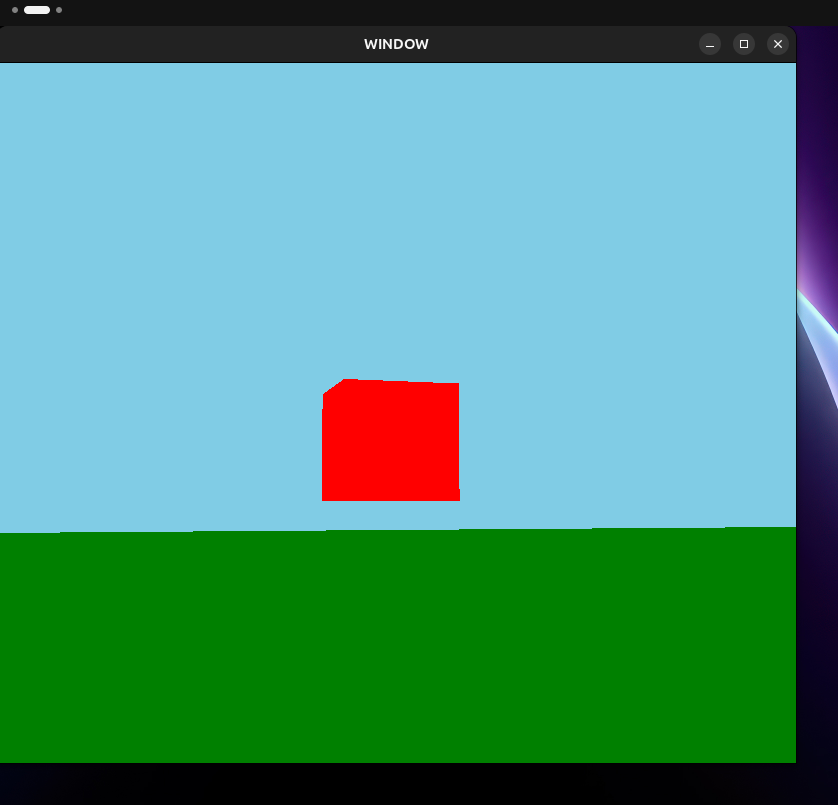

# OpenGL 3D Roaming Gravity Simulation ++

The goal is to simulate Gravity, Bouncing, Inertia and all sorts of natural world like behavior on objects. Materials will eventually be effected based what texture they have. Ex: ice will glide, metal will be heavy, water mechanics later on.

### Technical Stack
* **Language:** C++20
* **Graphics API:** OpenGL 3.3+ (core profile)
* **Windowing/Input:** GLFW / GLAD / GLM
* **Build System:** CMake
* **Platform:** Linux

### Data Analysis
* **Scientific Method Application:** Eventual Exportation of simulation logs to **CSV** and used **Python (Matplotlib)** to visualize performance.



## Building on Linux

### 1. Install dependencies

On Debian/Ubuntu:

```bash
sudo apt-get update
sudo apt-get install -y cmake pkg-config g++ \
    libglfw3-dev libgl1-mesa-dev \
    libx11-dev libxrandr-dev libxi-dev libxinerama-dev libxcursor-dev
```

On Fedora:

```bash
sudo dnf install -y cmake pkgconf-pkg-config gcc-c++ \
    glfw-devel mesa-libGL-devel \
    libX11-devel libXrandr-devel libXi-devel libXinerama-devel libXcursor-devel
```

On Arch:

```bash
sudo pacman -S --needed cmake pkgconf gcc glfw-x11 mesa libx11 libxrandr libxi libxinerama libxcursor
```

GLAD and GLM are already bundled in `physicsEngine/vendor/`, so you don't need to install them separately.

### 2. Build & Run

From the repo root:

```bash
./run.sh
```

## Controls

| Input          | Action                        |
|----------------|--------------------------------|
| `W` / `A` / `S` / `D` | Move forward / left / back / right |
| Mouse          | Look around                   |
| `Space`        | Jump (only while grounded)    |
| Move mouse to escape | Cursor is locked to the window while running |

Closing the window (or standard window-manager close) exits the program.

## Project Layout

```
PhysicsEngine/
├── CMakeLists.txt              # Linux/CMake build definition
├── physicsEngine/
│   ├── src/
│   │   ├── main.cpp            # Window/camera setup, input, physics + render loop
│   │   └── graphics/
│   │       ├── shader.h        # Minimal GLSL shader program wrapper
│   │       └── buffer.h        # VAO/VBO wrapper
│   ├── vendor/                 # Bundled header-only/loader dependencies
│   │   ├── glad/ glad.c        # OpenGL function loader
│   │   ├── glm/                # Header-only math library
│   │   └── KHR/                # Khronos platform headers (required by glad)
│   └── res/media/               # Images used in this README
```

GLFW is **not** vendored — it's linked against the system package (`libglfw3-dev`) via CMake's `find_package(glfw3)`.

## Troubleshooting

* `Could not find glfw3` from CMake → the `libglfw3-dev` (or distro equivalent) package isn't installed, or CMake can't find its config file. Re-check the install step above.
* Black window / immediate crash on a fresh VM or over SSH → you likely lack a GPU driver with OpenGL 3.3+ support, or you're running without a display (X11/Wayland) session. This app needs a real graphical session, not a headless terminal.
* Segfault on start → confirm your GPU driver supports at least OpenGL 3.3 core profile (`glxinfo | grep "OpenGL version"`, from the `mesa-utils` package, can help verify).
